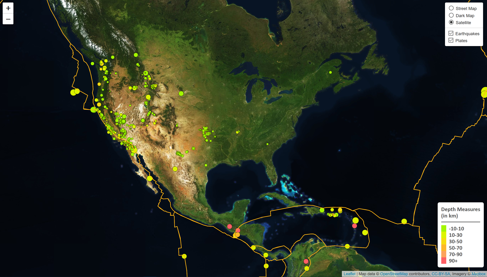
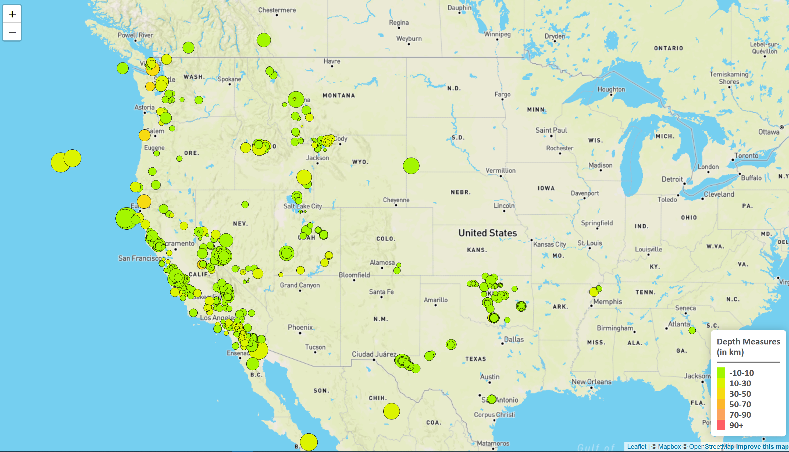
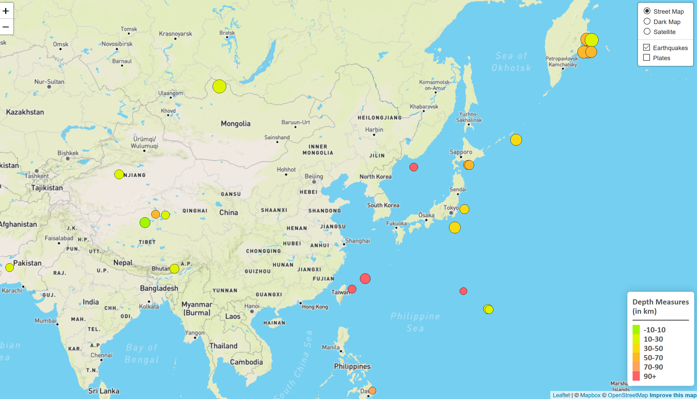
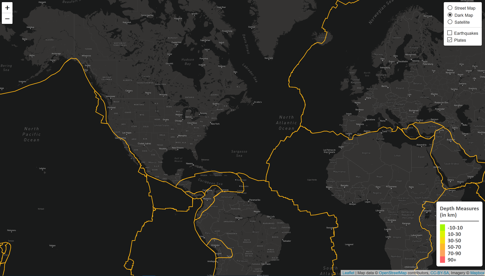

# leaflet-challenge
UCSD Mapping and Leaflet Challenge

## GitHub Pages Link:
Step 1: 
https://sanabuw.github.io/leaflet-challenge/Leaflet-Step-1/index.html

Step 2:
https://sanabuw.github.io/leaflet-challenge/Leaflet-Step-2/index.html

# Project Overview

This repository is for the mapping and Leaflet.js assignment for the UCSD Data Bootcamp. The concept of the assignment is to use Leaflet.js to generate visualization overlays on map images. The assignment covers the following concepts:
- Creating shape markers from GeoJSON data, using data found in feature properties to change shape size/color properties
- Drawing polyginal bordered objects from GeoJSON data
- Creating a layer control panel for user interaction
- Creating a legend for user reference

# File Overview
This project is separated into two levels of proficiency:

## Leaflet-Step-1
- Simple map layers generating only one overlay and one base layer with no layer control

## Leaflet-Step-2
- Multiple map layers with layer control

